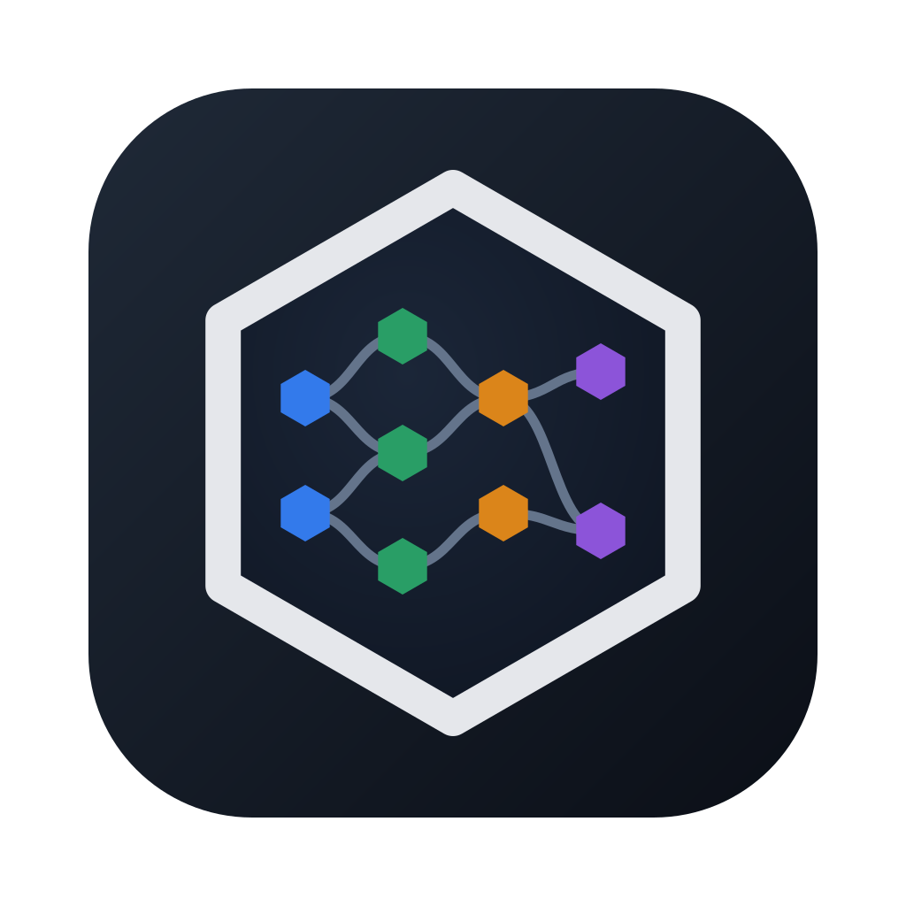
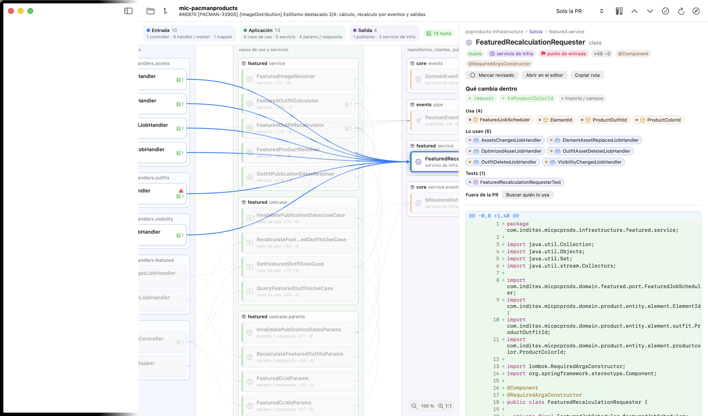

#  HexLens

App nativa de macOS para revisar PRs de Java como un hexágono. Cada fichero de la PR se coloca en su capa (entrada, aplicación, dominio, salida), agrupado por paquete y unido a lo que usa. Al pulsar un nodo se ve su diff, qué métodos cambian y con quién se relaciona.



## Añadir un perfil de arquitectura

1. Crea un tipo que implemente `ArchitectureProfile` (`id`, `name`, `languages`, `classify`, `violation`, `matchScore(paths:)` y `zone(for:)`).
2. Añádelo a `ProfileRegistry.all`. No hay que tocar nada más: la detección, el layout y el dibujo usan sus zonas.

## Qué resuelve

GitHub enseña una PR como una lista alfabética de ficheros. En un micro hexagonal eso desordena la historia: el controller sale antes que el puerto que usa, los tests se mezclan con el código, y no se ve si un adaptador se salta la aplicación. HexLens reordena la misma PR por arquitectura:

- **Notas de revisión**: selecciona líneas en el visor y pulsa `⌥⌘N` (o clic derecho → «Añadir nota…») para dejar una nota; marcador en el margen, lista «Notas» en la barra lateral, y se reanclan o se marcan como desactualizadas si el código cambia.
- **Notas a Claude**: `⌥⌘↩` (o «Enviar a Claude» en la lista de notas) manda las notas no enviadas —o las seleccionadas con ⌘clic— a la sesión de Claude enlazada a la rama de la PR (`claude --resume`); si no hay, abre una sesión nueva en el worktree de la rama. «Copiar» deja el texto en el portapapeles para pegarlo en Claude Desktop. La sesión se detecta sola en `~/.claude/projects` y puedes cambiarla o quitarla desde el menú «Sesión de Claude» de la sección Notas. Las enviadas llevan un icono de avión de papel y se pueden reenviar. La sección Notas y los métodos tocados van colapsados por defecto (se recuerda el estado).
- **Visor de código tipo IntelliJ**: fichero completo con los cambios marcados, colores de IntelliJ (claro y oscuro) y margen de números. Clic en una clase o en `objeto.metodo()` para ir a su definición, aunque esté fuera de la PR. Atrás y adelante con `⌘⌥←` / `⌘⌥→`, cambios con `⌘⌥↑` / `⌘⌥↓`. En una interfaz, salto a sus implementaciones. Búsqueda en el fichero con `⌘F` (resalta todo, `⌘G` / `⌘⇧G` siguiente y anterior; opciones de mayúsculas y palabra completa). Estructura del fichero con `⌘F12` (tipos, métodos y campos filtrables; marca los cambiados), migas `Clase › método` sobre el visor, resaltado de los usos del identificador bajo el cursor y franja de marcas a la derecha (cambios, notas y búsqueda) en la que se puede hacer clic. Diff unificado o lado a lado (base a la izquierda, cabeza a la derecha, scroll vertical sincronizado) con el conmutador de la cabecera o `⌥⌘D`. «Buscar usos» (`⌥F7` o clic derecho) abre un popup con todos los usos del identificador en el repo, agrupados por fichero y filtrables, y `↑` / `↓` + `Enter` saltan a la línea. Plegado de código (imports plegados por defecto, chevron en el margen o `⌘-` / `⌘+` en el cursor, `⌘⇧-` / `⌘⇧+` para todo); navegar o buscar dentro de una región plegada la despliega.
- **Explicar con Claude**: abre Terminal con una sesión de `claude` en el repo y un prompt que pide una explicación concisa de la PR o de un fichero. Se puede seguir preguntando.
- **Grafo jerárquico** según el perfil de arquitectura detectado: zonas (en ITX Infraestructura → Aplicación → Dominio, y Boot aparte) → módulos/componentes con chip de tecnología (`amanda · pipe`, `mongo`…) → contextos → ficheros. Entrada/salida es una flecha (↘ / ↗) en el nodo. Aristas finas y curvas; al pasar el ratón o seleccionar se resaltan las conectadas y se atenúa el resto. Con zoom < 50 % solo quedan los títulos de módulo y contexto.
- **Gestos del mapa**: pellizco para hacer zoom, dos dedos para desplazar (con inercia), doble toque con dos dedos para smart zoom, ⌘ + rueda para zoom en el cursor y arrastrar el fondo para mover. ⌘+ / ⌘- / ⌘0 con animación y **⌘9** ajusta el mapa a la ventana (también al cargar una PR).
- **Perfiles soportados**: ITX hexagonal (AMIGA), Ruby on Rails (Zeitwerk: controllers, consumers, jobs, services, policies, models, producers, `lib/api_clients`…), Java en capas genérico y Genérico.
- **Perfiles con autodetección**: se elige el lenguaje dominante de los cambios y, de sus perfiles, el de mayor `matchScore`; si ninguno pasa de 0,2 se usa el más parecido y, como último recurso, `GenericProfile`. El nombre del perfil sale en la cabecera del mapa y en el informe.
- **Orden de lectura** sugerido: dominio hacia fuera, entrada hacia dentro, tests primero o más grande primero. Cada test va pegado a la clase que prueba.
- **Punto de entrada**: la pieza más conectada dentro de la PR.
- **Métodos tocados** por fichero (`+ nuevo`, `~ cambiado`, `− quitado`), no solo líneas.
- **Reglas de capas** sobre los imports: el dominio no depende de infraestructura ni de framework, la aplicación no depende de adaptadores, y un adaptador de entrada no usa uno de salida del mismo micro. Indica si la violación entra con la PR o ya existía.
- **Contexto**: muestra opcionalmente ficheros sin cambios que conectan piezas de la PR. "Buscar quién lo usa" lista los ficheros de fuera de la PR que nombran el tipo.
- **Revisado** por fichero, guardado por commit de cabeza.

## Descargar

Cada release en [Releases](https://github.com/rodrigo-zayas/hexlens/releases) trae `HexLens-<versión>-macos-arm64.zip` (la app) y `hexlens-cli-<versión>-macos-arm64.tar.gz` (la CLI). Solo Apple Silicon, macOS 14 o superior.

Las dos están firmadas con Developer ID y notarizadas por Apple: se descomprime, se mueve `HexLens.app` a `/Applications` y se abre con doble clic. También se puede compilar (ver Uso).

## Uso

```bash
./scripts/build-app.sh            # dist/HexLens.app y dist/hexlens
./scripts/build-app.sh --install  # además la copia a /Applications
./scripts/make-icon.sh            # regenera Resources/AppIcon.icns desde docs/logo.svg
```

En la app: `⌥⌘O` abre un repo, `⌘O` va a una clase y `⌘⇧O` a un fichero (búsqueda difusa, también por iniciales CamelCase), `⌘P` elige PR (pedidas a mí, abiertas, mías, por número o comparando dos refs). Navegación: `⌘]` / `⌘[` siguiente o anterior en el orden de lectura, `⌘⇧]` siguiente sin revisar, `⌘D` marcar revisado.

Desde terminal:

```bash
open dist/HexLens.app --args -repo ~/Developer/work/app-editionimg/repos/mic-pacmanproducts -pr 46870
dist/hexlens summary --repo <repo> --pr 46870 [--order outsideIn]
dist/hexlens summary --repo <repo> --base 7d0a47c27fc^ --head 7d0a47c27fc
dist/hexlens prompt --repo <repo> --pr 46870   # el prompt que recibe Claude
dist/hexlens snapshot --repo <repo> --pr 46870 --out grafo.png [--context key|all] [--tests]
```

**Base distinta** (PRs apiladas): el menú «Base» de la barra compara la PR contra `develop` o `main` en vez de su base real, sin cambiar nada en GitHub. Desde terminal: `open dist/HexLens.app --args -repo <repo> -pr 46873 -base develop`.

Necesita `git` y `gh` con sesión iniciada. Las PRs se traen a `refs/hexlens/*` sin tocar tus ramas. Las PRs apiladas usan su base real, la rama de la PR anterior.

## Notas en Claude (MCP)

`hexlens mcp` es un servidor MCP por stdio con las notas de revisión (`list_review_notes`, `mark_notes_sent`), para que Claude las lea sin pegar el prompt. `build-app.sh` deja el binario en `dist/hexlens`:

```bash
claude mcp add hexlens -- /ruta/a/hexlens mcp
```

Claude Desktop, en `~/Library/Application Support/Claude/claude_desktop_config.json`:

```json
{ "mcpServers": { "hexlens": { "command": "/ruta/a/hexlens", "args": ["mcp"] } } }
```

## Cómo funciona

| Pieza | Fichero |
|---|---|
| git y `gh` por proceso, blobs en lote con `cat-file --batch` | `Sources/HexLensCore/Git.swift`, `GitHub.swift` |
| Extractor ligero de Java: paquete, imports, tipos, supertipos, anotaciones y rangos de métodos. No compila ni resuelve tipos | `Analysis/JavaAnalyzer.swift` |
| Extractor ligero de Ruby (`.rb`, `.rake`, `.jbuilder`): namespace, clase, `include`s, `def` con su rango y referencias a constantes como imports candidatos (lookup léxico). Nombres por convención Zeitwerk | `Analysis/RubyAnalyzer.swift` |
| Rails: zonas Entrada → Jobs → Servicios/Dominio → Modelos → Salida → Config/BD; contenedor `services · Flow`, `controllers · Dam::V1`; los specs se enlazan con su clase por ruta | `Architecture/RailsProfile.swift` |
| Convenciones AMIGA: módulos `*-domain/-application/-infrastructure/-components-*`, paquetes `com.inditex.<app>.<capa>.<contexto>` | `Architecture/ArchitectureProfile.swift` |
| Aristas por imports, wildcards y mismo paquete. Contexto, tests y violaciones | `Graph.swift` |
| Layout jerárquico zona → módulo → contexto con orden por baricentro | `GraphLayout.swift` |
| Perfiles genéricos y registro (`ProfileRegistry.all`) | `Architecture/GenericProfiles.swift` |
| UI SwiftUI | `Sources/HexLensUI` |

Para otros lenguajes o arquitecturas hay dos puntos de extensión:

- `LanguageAnalyzer`, para Kotlin o TypeScript (hoy Java y Ruby; `Analyzers.all` los registra y `Analyzers.for(path)` elige por extensión).
- `ArchitectureProfile`, para otras convenciones, por ejemplo Clean o jMolecules `@Port`/`@Adapter`.

### Límites conocidos

- Sin resolución de tipos, las aristas salen de imports y de nombres en el mismo paquete. Una referencia por nombre totalmente cualificado sin import no se ve.
- La clasificación es heurística por paquete, nombre y anotaciones. Lo que no encaja cae en "servicio de infra" u "otros". Para afinarla se añaden casos a `ProfileTests`.
- Los renombrados y movimientos cuentan como cambios normales. RefactoringMiner los separaría (ver ideas).

## Contribuir

- Se trabaja contra `develop` y se publica mergeando `develop` en `main`. Ninguna de las dos admite push directo, solo PR.
- Mensajes de commit y títulos de PR en [conventional commits](https://www.conventionalcommits.org/es/). Al llegar a `main`, `feat` sube la versión minor, `fix` y `perf` la patch, y `tipo!:` o `BREAKING CHANGE` la major. El resto (`chore`, `docs`, `refactor`…) no publica release.
- Cada push a `main` publica la release (`.github/workflows/release.yml`) y abre y mergea una PR de `main` a `develop` (`sync-develop.yml`). Si hay conflictos, el workflow falla y hay que resolverlos con una PR a `develop`.
- La release firma con Developer ID y notariza con los secretos del environment `release` (solo accesible desde `main`): `DEVELOPER_ID_P12_BASE64`, `DEVELOPER_ID_P12_PASSWORD`, `APPLE_API_KEY_P8`, `APPLE_API_KEY_ID` y `APPLE_API_ISSUER_ID`. En local: `HEXLENS_SIGN_IDENTITY="Developer ID Application: …" ./scripts/build-app.sh` y después `./scripts/notarize.sh`.

## Investigación

Ninguna herramienta actual hace esto:

- **CodeSee Review Maps**, lo más parecido, cerró tras la compra de GitKraken en 2024.
- **CodeRabbit** y **Greptile** generan diagramas de secuencia estáticos en la web.
- **Sonar Architecture**, **Sonargraph** y **ArchUnit** conocen las capas, pero miran el repo entero y no la PR.
- **IntelliJ** pinta los cambios locales como UML, sin capas.

Lo que respalda cada decisión:

- **Orden en vez de alfabético.** Fregnan et al., *First come first served* (ESEC/FSE 2022): los ficheros del final reciben menos atención, y la probabilidad (odds) de detectar uno de los tipos de defecto estudiados cae un 64 % si su fichero va el último. Rahman et al., *Breaking the Alphabet* (ICSE 2026): en una encuesta a 1.355 desarrolladores, el 66 % pide agrupar por dependencias.
- **Macroestructura primero, siguiendo dependencias.** Baum, Schneider y Bacchelli, *On the optimal order of reading source code changes for review* (ICSME 2017), con la herramienta CoRT. Wurzel Gonçalves et al., *Code Review Comprehension* (ICPC 2025): el revisor construye contexto antes de inspeccionar.
- **Trozos que quepan en la cabeza.** Baum et al., *Working memory capacity and code change ordering* (EMSE 2019).
- **Descomponer por relaciones definición-uso.** Barnett et al., *ClusterChanges* (ICSE 2015). Tao y Kim (MSR 2015). Di Biase et al. (PeerJ CS 2019): descomponer reduce los falsos positivos.
- **Grafo de la PR.** Fregnan et al., *ReviewVis* (JSS 2023): clases y llamadas como grafo, el precedente más cercano. No agrupa por capa.
- **Tests junto a la clase.** Spadini et al., *Test-Driven Code Review* (ICSE 2019).
- **Clase saliente como punto de entrada.** Huang et al. (ESEC/FSE 2018 NIER).
- **Violaciones de arquitectura.** Li et al., *Symptoms of architecture erosion in code reviews* (ICSA 2022): las violaciones de arquitectura son el síntoma de erosión más comentado en review.
- **Refactorizaciones aparte.** Brito y Valente, *RAID* (ICPC 2021). RefactoringMiner 2.0 (TSE 2020).

No encontré trabajos que agrupen un diff por capa hexagonal.

## Ideas siguientes

- Pasar RefactoringMiner para mostrar los movimientos y renombrados como una sola arista.
- Agrupar dentro de cada capa por clústeres definición-uso, con nombre puesto por un LLM.
- Mostrar en el nodo los comentarios de review de GitHub (`gh api`) y comentar desde la app.
- Un perfil Kotlin/TypeScript para las SPAs.
